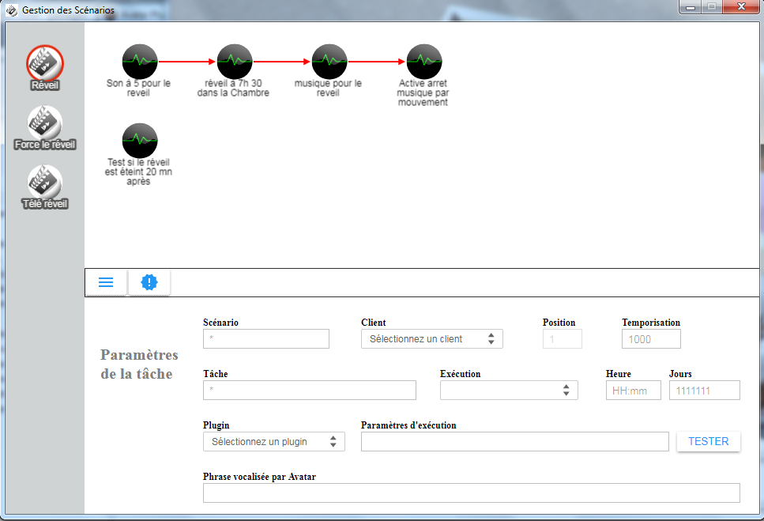

# Scenariz

Ce plugin est un add-on pour le framework [A.V.A.T.A.R](https://spikharpax.github.io/A.V.A.T.A.R/).

_Scenariz_ vous donne le pouvoir de créer des scénarios de tâches à exécuter par A.V.A.T.A.R en utilisant les actions des plug-ins et ceci sans aucun développement !

Vous disposez d'une interface intelligente pour vous guider dans la création de vos scénarios :

Ces scénarios peuvent être démarrés:
- Automatiquement à heure fixe.
- Immédiatement ou en différés par règle vocale.

Il vous permet aussi de gérer ces scénarios par règles vocales:
* L'état du scénario:
    * Actif ou inactif.
* Le nombre de tâches dans le scénario.
* L'heure et les jours de la semaine de son exécution.
* Activation/Désactivation du scénario.
* Modification de l'heure et minutes de son exécution:
* Par plage de 5mn ou 15mn.
* Par plage de 1h ou 5h.
* Modification des jours d'exécution en précisant:
    * La semaine de travail.
    * La semaine entière.
    * Spécifiquement les jours de la semaine
* Suppression du scénario

***
## ★ Installation
* Téléchargez le projet depuis la bibliothèque de plug-ins A.V.A.T.A.R

**Compatibilité:** A.V.A.T.A.R Serveur >= 3.4

***
## ★ Configuration et utilisation
* Ouvrez le Plug-in Studio A.V.A.T.A.R
* Cliquez sur l'icône du plug-in scenariz
* Dans son menu déroulant, cliquez sur _Documentation_

***
## Historique
2.0 (29-12-2020)
- Interface de création de scénarios avec workflow graphique

1.1 (03-11-2017)
- Les fichiers intent et action déplacés dans le répertoire du plugin. Chargés automatiquement (Avatar serveur 0.1.5)

1.0 (14-04-2017)
- Version Released

***
## ★ License
Logiciel libre sous [licence MIT](https://github.com/Spikharpax/A.V.A.T.A.R/blob/master/LICENSE)

Copyright (c) 2020 A.V.A.T.A.R - Stéphane Bascher
